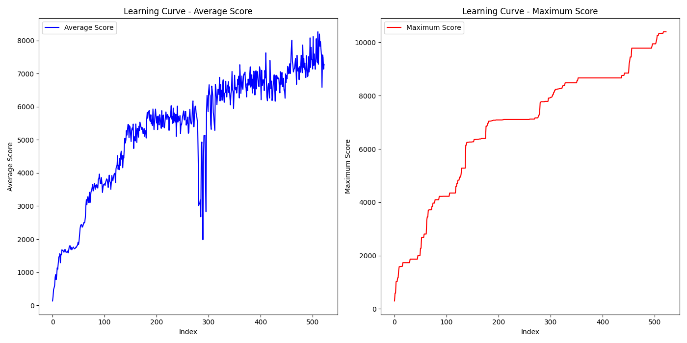

# Jump Bot
## Nauka agenta do skakania po planszy
Autorzy: Robert Barcik, Miłosz Góralczyk, Jakub Kot

### Link do repozytorium
[Genetic Jump King](https://github.com/Eniterusx/genetic-jump-king)

### Cel projektu
Celem projektu jest stworzenie agenta, który nauczy się przechodzić tor przeszkód w środowisku symulacyjnym. Agent ma za zadanie nawigować po platformach, jednocześnie unikając przeszkód. Agent jest dodatkowo nagradzany za przechodzenie planszy jak najszybciej. Jedyny sposób poruszania się agenta to skakanie. Agent ma kontrolę nad siłą skoku oraz kierunkiem, w którym skacze.

Środowisko agenta inspirowane jest grą zręcznościową Jump King, w której gracz steruje postacią, która porusza się poprzez skakanie. Gracz musi skakać z platformy na platformę, unikając przeszkód oraz upadku.

### Metodologia
Aby zrealizować cel, zdecydowaliśmy się na wykorzystanie algorytmów genetycznych. W pierwszym kroku zaimplementowaliśmy środowisko symulacyjne, w którym agent będzie się poruszał. Wykorzystaliśmy do tego bibliotekę Pygame. Następnie stworzyliśmy agenta, który będzie się uczył poruszania po planszy. Agent reprezentowany jest przez chromosom składający się z listy genów. Każdy gen to para liczb, które reprezentują odpowiednio kierunek i siłę skoku. Kierunek jest jedną z trzech wartości: 0 - skok w górę, -1 - skok w lewo, 1 - skok w prawo. Siła skoku należy do jednej z 10 predefiniowanych wartości.

W każdej iteracji algorytmu, agent jest oceniany na podstawie tego, jak daleko zdołał dojść na planszy, oraz w jaką ilość skoków przechodził przez poszczególne punkty kontrolne. Następnie wybierane są najlepsze osobniki, które są krzyżowane oraz mutowane. Krzyżowanie polega na wymianie części genów między rodzicami. Mutacja polega na zupełnej podmianie genu na losowy, lub wzięcie jednego z genów i przesunięcie go na koniec chromosomu. Dodatkowo, w celu przyspieszenia procesu ewolucyjnego wprowadziliśmy zwiększoną szansę na mutację dla kilku skoków zaraz przed porażką agenta, gdyż to zazwyczaj one były przyczyną porażki. Numer skoku, który jest brany pod uwagę, jest dziedziczony losowo od jednego z rodziców.

#### Parametry algorytmu
- Wielkość populacji: 100
- Ilość genów w chromosomie: 150
- Szansa na mutację: 0.01
- Szansa na mutację w ostatnich 5 genach: 0.05
- Ilość najlepszych osobników wybieranych do reprodukcji: 5

### Opis środowiska symulacyjnego
Środowisko symulacyjne jest grą platformową z prostą symulacją fizyki. Wyzwanie agenta polega na przemierzaniu wcześniej przygotowanej planszy, na której znajdują się platformy oraz przeszkody.


Środowisko składa się z następujących elementów:
- Agent (kolor zielony): Agent jest reprezentowany przez prostokąt, który porusza się po planszy.
- Bloki (kolor czarny): Agent może na nich stanąć, jeśli wyląduje na nich od góry. W przypadku uderzenia w blok z boku lub od dołu, agent odbija się od niego.
- Platformy (kolor brązowy): Podobnie jak bloki, agent może na nich stanąć, jeśli wyląduje na nich od góry. W przeciwieństwie do bloków, platformy nie blokują ruchu agenta z boku i od dołu.
- Przeszkody (kolor czerwony): Agent nie może na nich stanąć. W przypadku dotknięcia przeszkody, agent natychmiastowo przegrywa.
- Punkty kontrolne (kolor niebieski): Są to punkty, które agent musi odwiedzić, aby zostać nagrodzonym. Punkty rozmieszczone są blisko siebie, oraz rozmieszczone są w takich sposób, aby nie było możliwe ich ominięcie. Agent jest nagradzany za każdy punkt kontrolny, który odwiedził. Nagroda za punkt kontrolny jest zależna od tego, w jakiej ilości skoków agent go odwiedził. Im mniej skoków, tym większa nagroda.

### Wyniki
Agentom udało się nauczyć pokonywać trasę. Czas potrzebny na nauczenie agenta genetycznego wynosił około 2.5 godziny. Najniższa liczba skoków, w którą udało się agentowi pokonać trasę, wynosi 72. Poniżej przedstawiamy wyniki agenta po 520 generacjach.  Lewy wykres przedstawia średni fitness wszystkich osobników w danej generacji. Prawy wykres przedstawia najlepszy osiągnięty wynik we wszystkich generacjach.


Na lewym wykresie wyraźnie widoczny jest drastyczny spadek średniego fitnessu w okolicach 300 generacji. Prawdopodobnie wynika to z niekorzystnych mutacji większości agentów w danej generacji. Problem ten potencjalnie dałoby się rozwiązać zwiększając liczbę osobników w populacji. Mimo tego, agentom szybko udało się ponownie osiągnąć wysoki poziom fitnessu. 

Niestety nie możemy porównać naszego wyniku z wynikami innych autorów, jako, że nasze środowisko jest unikalne. Podobny problem jednak został poruszony w artykule [Hybrid of Rule-based Systems Using Genetic Algorithm to Improve Platform Game Performance](https://www.researchgate.net/publication/275067821_Hybrid_of_Rule-based_Systems_Using_Genetic_Algorithm_to_Improve_Platform_Game_Performance), gdzie autorzy również wykorzystali algorytmy genetyczne do nauczenia agenta poruszania się po planszy w grze platformowej.

### Wynik optymalny
Wynik agenta został porównany z wynikiem optymalnym. Wynik agenta wynosi 72 skoki, tymczasem wynik optymalny wynosi 56 skoków. W celu znalezienia optymalnego wyniku, potrzebne było około 10 godzin.

### Wnioski
Pomimo niewielkich zastojów w nauczaniu od czasu do czasu, agent ostatecznie znajduje dalszą drogę. Agent jest w stanie nauczyć się pokonywać trasę oraz znajduje wynik zbliżony do optymalnego. Warto pamiętać, że agent nie posiada żadnej wiedzy na temat środowiska, w którym się porusza. Wszystko, co wie, wynika z ewolucji. Nie potrafi więc generalizować swojej wiedzy na inne środowiska.

Agent prawidłowo uczy się pokonywać trasę. Nie jest w prawdzie optymalny, ale odbiega od optymalnego wyniku tylko o ~22%. Jest wystarczająco dobry, gdy celem jest tylko znalezienie jakiegokolwiek rozwiązania. 
Główną zaletą algorytmu jest jego czas i łatwość działania. Znalezienie optymalnego wyniku wymagało czterokrotnie większego nakładu czasu oraz okresowej kontroli, a także ręcznego połączenia ścieżek wynikowych. W przypadku algorytmu genetycznego wystarczyło uruchomienie programu i oczekiwanie na końcowe rezultaty.

Opracowany przez nas system potrafi rozwiązywać problemy bez konieczności posiadania szczegółowej wiedzy na ich temat.
Dzięki zastosowaniu elementów algorytmu genetycznego, odpowiadającego za wybór ruchów agenta, system uczy się zasad i zawiłości potrzebnych do skutecznej nawigacji w danym środowisku. W efekcie osiąga wyznaczony cel w czasie znacznie krótszym niż przy użyciu tradycyjnych metod.
Proponujemy zastosowanie tego algorytmu w szerszym kontekście jako narzędzia do rozwiązywania różnorodnych problemów. Jeśli dany problem można sprowadzić do zestawu zasad, decyzji, ograniczeń i celu oraz możliwe jest odwzorowanie go na dwuwymiarową mapę, to algorytm byłby w stanie go rozwiązać. Agent, analizując każdy ruch, dąży do osiągnięcia celu przy jak najmniejszej liczbie kroków, co prowadzi do skutecznego znalezienia rozwiązania.

### Kompilacja
Wymagania:
```
python==3.11
Pygame==2.6.1
scikit-image==0.24.0
```
Aby uruchomić program, należy sklonować repozytorium i uruchomić plik `game_agent.py`. Agent samoistnie rozpocznie proces uczenia. Domyślnie w programie zmienne `agents_filename` i `fitness_filename` są ustawione na wartość `None`, co oznacza, że agent rozpocznie naukę od zera. W celu wczytania wcześniej nauczonych agentów, należy zmienić wartość tych zmiennych na ścieżkę do pliku z agentami oraz pliku z historią fitnessu.

Aby przetestować nauczonego wcześniej agenta, można odkomentować linię 332, a następnie uruchomić program.

Aby włączyć lub wyłączyć podgląd zachowania agentów, należy nacisnąć klawisz `Spacja`. Rekomenduje się wyłączenie podglądu w celu przyspieszenia procesu uczenia.

Dodatkowo można spróbować swoich sił w grze, korzystając z pliku `game_player.py`.

#### Sterowanie:
- Wybranie kierunku skoku: 
    -  `Q` -  lewo
    -  `W` -  góra
    -  `E` -  prawo
- Wybranie siły skoku:
    - Klawisze numeryczne od `1` do `0` - od najmniejszej do największej siły skoku

### Sprzęt i oprogramowanie
Projekt został zrealizowany przy użyciu języka Python w wersji 3.11.10. Do stworzenia środowiska symulacyjnego wykorzystaliśmy bibliotekę Pygame w wersji 2.6.1. Do zarządzania kodem źródłowym wykorzystaliśmy system kontroli wersji Git. 

Program był testowany na urządzeniach z systemem operacyjnym Windows 10.

### Kwerenda literaturowa
1. [What are evolutionary algorithms?](
https://medium.com/data-science-in-your-pocket/what-are-evolutionary-algorithms-fb642f72db34) Dostęp: 2024-09-10
2. [Introduction to Genetic Algorithms: Python](
https://medium.com/@Data_Aficionado_1083/genetic-algorithms-optimizing-success-through-evolutionary-computing-f4e7d452084f) Dostęp: 2024-09-10
3. [An Introduction to Genetic Algorithms](
https://www.whitman.edu/Documents/Academics/Mathematics/2014/carrjk.pdf) Dostęp: 2024-09-10
4. [Hybrid of Rule-based Systems Using Genetic Algorithm to Improve Platform Game Performance](
https://www.researchgate.net/publication/275067821_Hybrid_of_Rule-based_Systems_Using_Genetic_Algorithm_to_Improve_Platform_Game_Performance) Dostęp: 2024-09-10
5. [Building a Game-Playing Agent for CoinTex Using the Genetic Algorithm](https://www.researchgate.net/publication/344347559_Building_a_Game-Playing_Agent_for_CoinTex_Using_the_Genetic_Algorithm) Dostęp: 2024-09-10